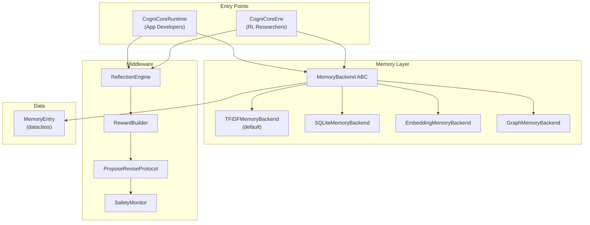

# Contributing to CogniCore NEXUS

Thank you for your interest in contributing to CogniCore NEXUS! Whether you're fixing a bug, adding a memory backend, building an integration, or improving docs — every contribution matters.

This guide covers everything you need to go from fork to merged PR.

---

## Table of Contents

- [Getting Started](#getting-started)
- [Architecture Overview](#architecture-overview)
- [Module Map](#module-map)
- [How to Add a New Memory Backend](#how-to-add-a-new-memory-backend)
- [How to Add a New Environment](#how-to-add-a-new-environment)
- [How to Add an Integration](#how-to-add-an-integration)
- [Testing Conventions](#testing-conventions)
- [Code Style](#code-style)
- [Pull Request Process](#pull-request-process)
- [Release Process](#release-process)

---

## Getting Started

1. **Fork** the repository on GitHub: [github.com/Kaushalt2004/cognicore-my-openenv](https://github.com/Kaushalt2004/cognicore-my-openenv)

2. **Clone your fork** locally:
   ```bash
   git clone https://github.com/YOUR_USERNAME/cognicore-my-openenv.git
   cd cognicore-my-openenv
   ```

3. **Install in development mode** with all dev dependencies:
   ```bash
   pip install -e ".[dev]"
   ```

4. **Verify everything works** by running the test suite:
   ```bash
   pytest tests/
   ```
   All 525 tests should pass. If any fail, please open an issue before proceeding.

5. **Create a feature branch**:
   ```bash
   git checkout -b feature/your-feature-name
   ```

---

## Architecture Overview

CogniCore NEXUS provides runtime cognition — memory, reflection, and adaptive execution — for AI agents. There are two entry points that share the same middleware pipeline:

| Entry Point | Audience | Purpose |
|---|---|---|
| `CogniCoreRuntime` | Application developers | Wraps any callable agent with memory + reflection |
| `CogniCoreEnv` | RL researchers | Gymnasium-compatible environments for training agents |



**Key design principles:**

- **`MemoryBackend`** is an abstract base class (ABC). All memory implementations subclass it and implement the same 5 methods.
- **`MemoryEntry`** is the canonical data type — a Python dataclass, not a raw dict.
- Both entry points feed into the same middleware chain: `ReflectionEngine → RewardBuilder → ProposeReviseProtocol → SafetyMonitor`.

---

## Module Map

| Directory | Purpose | Key Files |
|---|---|---|
| `cognicore/core/` | Core runtime, config, base classes | `runtime.py`, `config.py`, `protocol.py` |
| `cognicore/memory/` | Memory backend ABC and all implementations | `backend.py`, `tfidf.py`, `sqlite.py`, `embedding.py`, `graph.py` |
| `cognicore/middleware/` | Reflection, rewards, safety, propose-revise | `reflection.py`, `rewards.py`, `safety.py` |
| `cognicore/mcp/` | Model Context Protocol server | `server.py`, `tools.py` |
| `cognicore/envs/` | Gymnasium-compatible environments | `base.py`, `safety.py`, `code_bugs.py` |
| `cognicore/immune/` | Agent Immune System (anomaly detection) | `detector.py`, `response.py` |
| `cognicore/replay/` | Replay Time Travel with RL | `buffer.py`, `persistence.py` |
| `cognicore/agents/` | Built-in agent implementations | `base.py`, `random_agent.py`, `smart_agents.py` |
| `cognicore/integrations/` | LangChain, CrewAI, and other framework adapters | `langchain.py`, `crewai.py` |

---

## How to Add a New Memory Backend

Adding a new memory backend (e.g., Redis, Pinecone, Qdrant) is one of the best first contributions.

### Step 1: Subclass `MemoryBackend`

Create a new file in `cognicore/memory/`:

```python
# cognicore/memory/redis.py
from cognicore.memory.backend import MemoryBackend
from cognicore.memory.entry import MemoryEntry


class RedisMemoryBackend(MemoryBackend):
    """Redis-backed memory storage for CogniCore agents."""

    def __init__(self, redis_url: str = "redis://localhost:6379"):
        self.redis_url = redis_url
        # ... connection setup
```

### Step 2: Implement the 5 required methods

Every `MemoryBackend` subclass must implement:

| Method | Signature | Purpose |
|---|---|---|
| `store` | `store(entry: MemoryEntry) -> None` | Persist a memory entry |
| `get_by_category` | `get_by_category(category: str, limit: int) -> list[MemoryEntry]` | Retrieve entries by category |
| `search` | `search(query: str, top_k: int) -> list[MemoryEntry]` | Semantic/keyword search |
| `clear` | `clear() -> None` | Remove all stored entries |
| `size` | `size() -> int` | Return total number of entries |

```python
def store(self, entry: MemoryEntry) -> None:
    """Store a MemoryEntry in Redis."""
    ...

def get_by_category(self, category: str, limit: int = 10) -> list[MemoryEntry]:
    """Retrieve entries filtered by category."""
    ...

def search(self, query: str, top_k: int = 5) -> list[MemoryEntry]:
    """Search for relevant memories."""
    ...

def clear(self) -> None:
    """Remove all entries from the store."""
    ...

def size(self) -> int:
    """Return the number of stored entries."""
    ...
```

### Step 3: Register in `__init__.py`

Add your backend to `cognicore/memory/__init__.py`:

```python
from cognicore.memory.redis import RedisMemoryBackend

__all__ = [
    ...,
    "RedisMemoryBackend",
]
```

### Step 4: Add tests

Create `tests/test_redis_memory_backend.py`:

```python
import pytest
from cognicore.memory.redis import RedisMemoryBackend
from cognicore.memory.entry import MemoryEntry


@pytest.fixture
def backend():
    backend = RedisMemoryBackend()
    backend.clear()
    yield backend
    backend.clear()


def test_store_and_retrieve(backend):
    entry = MemoryEntry(content="test data", category="test")
    backend.store(entry)
    results = backend.get_by_category("test", limit=5)
    assert len(results) == 1
    assert results[0].content == "test data"


def test_search(backend):
    entry = MemoryEntry(content="important finding", category="research")
    backend.store(entry)
    results = backend.search("important", top_k=3)
    assert len(results) >= 1


def test_clear(backend):
    backend.store(MemoryEntry(content="temp", category="test"))
    backend.clear()
    assert backend.size() == 0
```

> **Important:** Use `MemoryEntry` dataclass instances — never raw dicts. Use the concrete backend class name (e.g., `TFIDFMemoryBackend`), not the old `Memory` alias.

---

## How to Add a New Environment

Environments follow the Gymnasium pattern and live in `cognicore/envs/`.

### Step 1: Subclass `CogniCoreEnv`

```python
# cognicore/envs/my_task.py
from cognicore.envs.base import CogniCoreEnv


class MyTaskEnv(CogniCoreEnv):
    """Environment for [describe your task domain]."""

    def _build_task(self, difficulty: str):
        """Generate a task instance for the given difficulty."""
        ...

    def _evaluate_action(self, action: str) -> dict:
        """Evaluate the agent's action and return reward components."""
        ...
```

### Step 2: Register in the environment registry

Add your environment to the registry so it's available via `cognicore.make()`:

```python
# In cognicore/envs/__init__.py or the registry module
register(
    id="MyTask-v1",
    entry_point="cognicore.envs.my_task:MyTaskEnv",
)
```

### Step 3: Add difficulty variants

By convention, create Easy/Medium/Hard variants:

```python
for difficulty in ["Easy", "Medium", "Hard"]:
    register(
        id=f"MyTask{difficulty}-v1",
        entry_point="cognicore.envs.my_task:MyTaskEnv",
        kwargs={"difficulty": difficulty.lower()},
    )
```

### Step 4: Write tests

Create `tests/test_my_task_env.py` covering `reset()`, `step()`, reward structure, and episode termination.

---

## How to Add an Integration

CogniCore provides adapters for popular agent frameworks. Follow the existing pattern from the LangChain and CrewAI integrations.

### Pattern

```python
# cognicore/integrations/my_framework.py
from cognicore.core.runtime import CogniCoreRuntime
from cognicore.memory.tfidf import TFIDFMemoryBackend


class MyFrameworkAdapter:
    """Adapter that wraps CogniCoreRuntime for use with MyFramework."""

    def __init__(self, runtime: CogniCoreRuntime | None = None, **kwargs):
        self.runtime = runtime or CogniCoreRuntime(
            memory_backend=TFIDFMemoryBackend(),
            **kwargs,
        )

    def as_tool(self):
        """Export CogniCore memory/reflection as a tool for MyFramework agents."""
        ...

    def wrap_agent(self, agent):
        """Wrap a MyFramework agent with CogniCore cognition."""
        ...
```

### Checklist for integrations

- [ ] Adapter class in `cognicore/integrations/`
- [ ] Framework-specific dependency listed as an optional extra in `pyproject.toml`
- [ ] Graceful `ImportError` handling if the framework isn't installed
- [ ] Tests in `tests/test_integration_my_framework.py`
- [ ] Usage example in `examples/`

---

## Testing Conventions

CogniCore has **525 tests** and we intend to keep them all green.

### File naming

- Test files: `test_*.py` (pytest discovery pattern)
- Place tests in the `tests/` directory, mirroring the source structure

### Key rules

| Do | Don't |
|---|---|
| Use `TFIDFMemoryBackend` (or other concrete backends) | Use the old `Memory` class name |
| Create `MemoryEntry(...)` dataclass instances | Pass raw `dict` objects to memory methods |
| Use `get_by_category()` for retrieval | Use deprecated `get_context()` or `retrieve()` |
| Test one behavior per test function | Write monolithic test functions |
| Use `pytest.fixture` for shared setup | Duplicate setup code across tests |

### Running tests

```bash
# Run all tests
pytest tests/

# Run a specific test file
pytest tests/test_tfidf_memory_backend.py

# Run with verbose output
pytest tests/ -v

# Run tests matching a pattern
pytest tests/ -k "memory"
```

### Marks

Use `@pytest.mark.slow` for tests that take >5 seconds (benchmarks, large datasets). These are excluded in CI fast-runs.

---

## Code Style

We use **Ruff** for linting and formatting.

### Configuration

| Setting | Value |
|---|---|
| Formatter | Ruff |
| Line length | **120** |
| Target Python | 3.9+ |
| Docstrings | Google style |

### Running Ruff

```bash
# Check for issues
ruff check .

# Auto-fix what's possible
ruff check . --fix

# Format code
ruff format .
```

### Docstring guidelines

Every public class and function should have a docstring:

```python
def search(self, query: str, top_k: int = 5) -> list[MemoryEntry]:
    """Search stored memories for entries relevant to the query.

    Args:
        query: The search string to match against stored memories.
        top_k: Maximum number of results to return.

    Returns:
        A list of MemoryEntry objects ranked by relevance.
    """
```

---

## Pull Request Process

1. **Create a branch** from `main`:
   ```bash
   git checkout -b feature/your-feature-name
   ```

2. **Make your changes** following the code style and testing conventions above.

3. **Run the full test suite** and ensure all 525+ tests pass:
   ```bash
   pytest tests/
   ```

4. **Run the linter** and fix any issues:
   ```bash
   ruff check . --fix
   ruff format .
   ```

5. **Commit with a clear message** using conventional commit format:
   ```
   feat(memory): add Redis memory backend
   fix(reflection): handle empty memory in ReflectionEngine
   docs: update CONTRIBUTING.md with new backend guide
   test(envs): add coverage for MyTaskEnv edge cases
   ```

6. **Push and open a PR** against `main`:
   ```bash
   git push origin feature/your-feature-name
   ```

7. **Fill out the PR template** with:
   - What the PR does and why
   - How to test the changes
   - Any breaking changes or migration notes

8. **Address review feedback** — we aim to review PRs within 48 hours.

### PR merge criteria

- [ ] All CI checks pass (tests, lint, type checks)
- [ ] At least one maintainer approval
- [ ] No unresolved review comments
- [ ] CHANGELOG.md updated (for user-facing changes)

---

## Release Process

Releases are managed by maintainers. Here's the process for reference:

1. **Update version** in `pyproject.toml`:
   ```toml
   [project]
   version = "0.9.4"
   ```

2. **Update `CHANGELOG.md`** with all changes under a new version heading, following [Keep a Changelog](https://keepachangelog.com/en/1.1.0/) format.

3. **Create a release commit**:
   ```bash
   git add pyproject.toml CHANGELOG.md
   git commit -m "release: v0.9.4"
   ```

4. **Tag the release**:
   ```bash
   git tag v0.9.4
   git push origin main --tags
   ```

5. **Publish to PyPI**:
   ```bash
   python -m build
   twine upload dist/*
   ```

6. **Create a GitHub Release** with release notes from the CHANGELOG entry.

---

## Questions?

- **Issues:** [github.com/Kaushalt2004/cognicore-my-openenv/issues](https://github.com/Kaushalt2004/cognicore-my-openenv/issues)
- **Discussions:** [github.com/Kaushalt2004/cognicore-my-openenv/discussions](https://github.com/Kaushalt2004/cognicore-my-openenv/discussions)

Thank you for helping make CogniCore NEXUS better! 🚀
