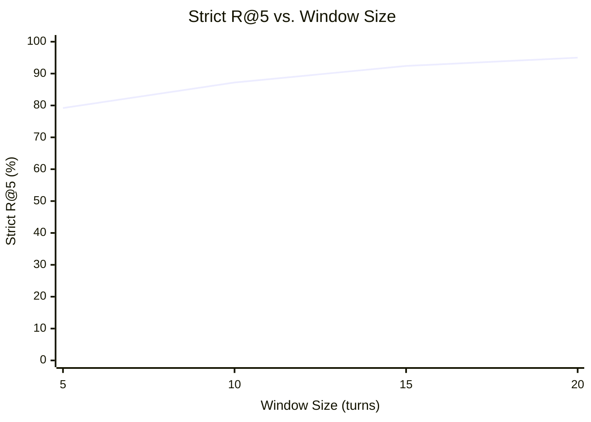

# Ablation Study Results

- **Window Size 5**: 79.2%
- **Window Size 10**: 87.2%
- **Window Size 15**: 92.4%
- **Window Size 20**: 95.0%

```mermaid
xychart-beta
    title "Strict R@5 vs. Window Size"
    x-axis "Window Size (turns)" [5, 10, 15, 20]
    y-axis "Strict R@5 (%)" 0 --> 100
    line [79.2, 87.2, 92.4, 95.0]
```
